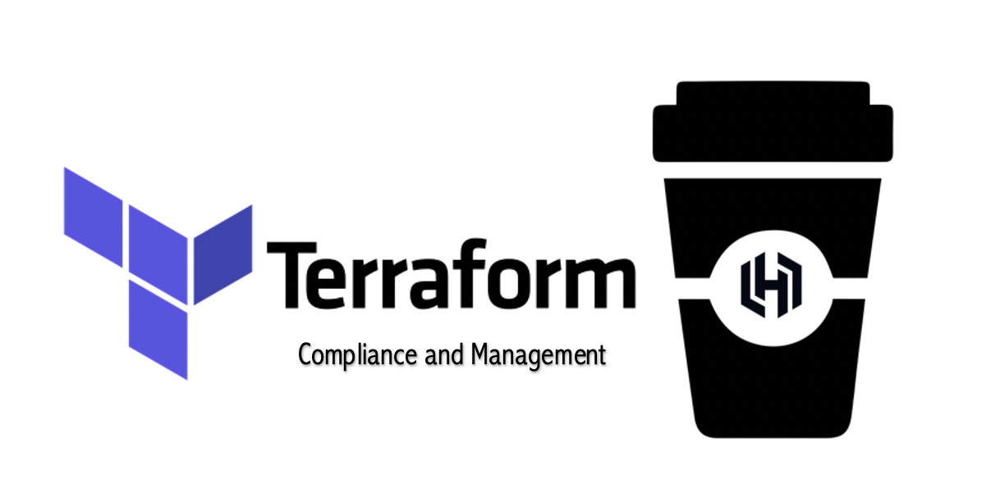
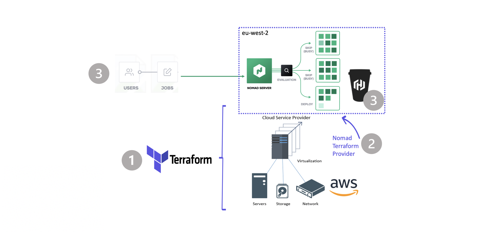
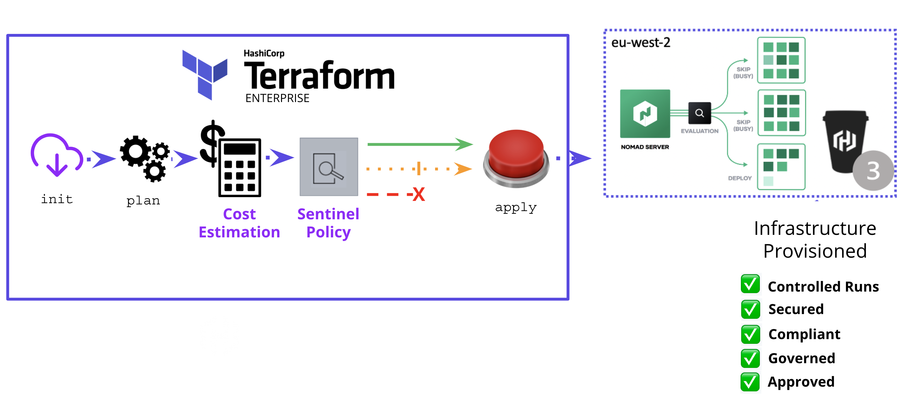
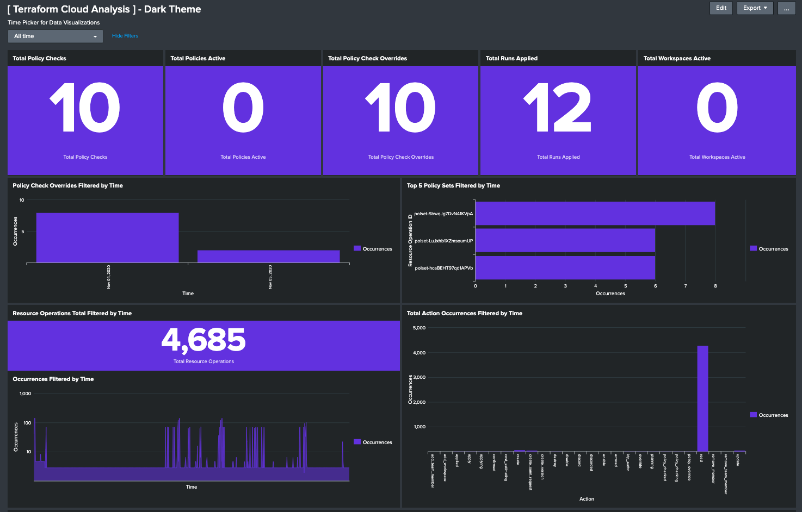
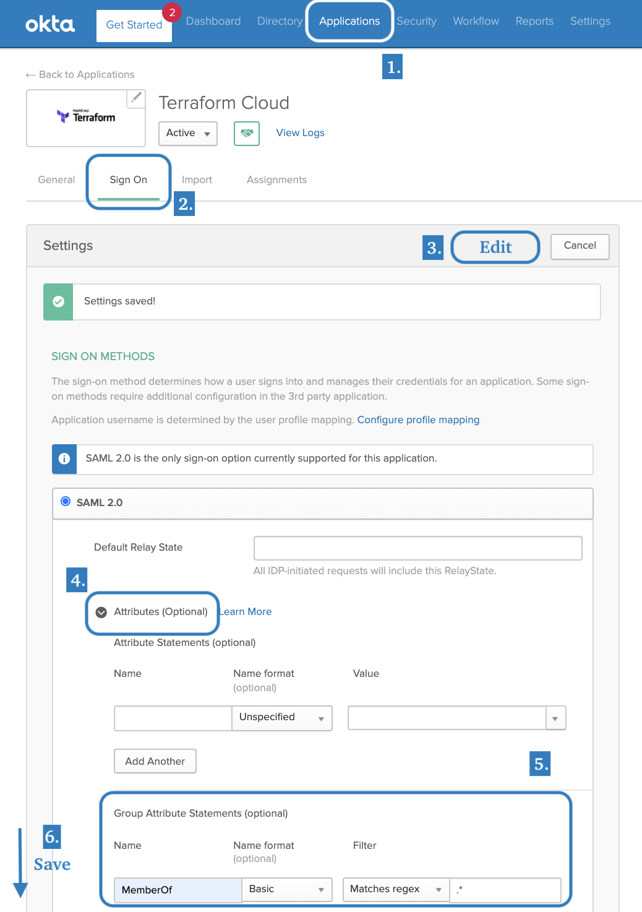
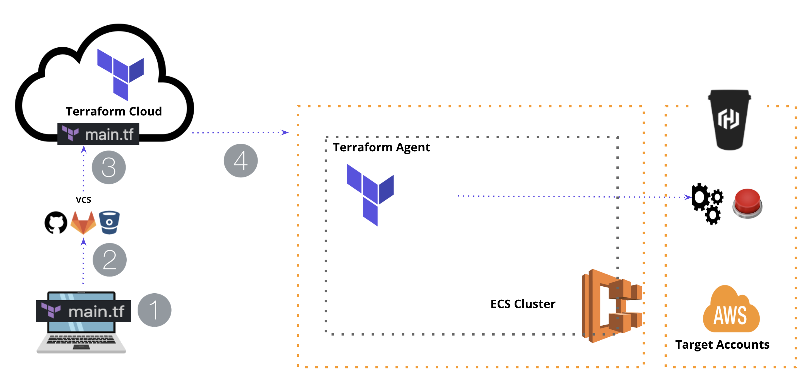

name: Intro-to-Terraform-Cloud
class: center,middle,title-slide
count: false
  

  
# Infrastructure That Enables Innovation

???
**.**

---
class: img-caption
name: current-state
# HashiCups Application, day 1

???
BSK Inc. Bringing energy to your mornings through HashiCups.

* BSK Inc. is using Terraform Cloud free tier for a number of years.
* Why Terraform? -  to standardize HashiCups usage across the company.
* Why Now? - to mitigate security vulnerability + to meet all of the compliance regulations and guidelines.

---
class: img-caption
name: end-state
# HashiCups Application, day 2

???
Through Terraform Cloud for Business, BSK Inc. can meet its expanded needs:
  * Ensure compliance with external standards.
  * Protect data privacy and infrastructure integrity.
  * Estimate the costs of the infrastructure that is provisioned with Terraform.
  * Bring visibility into all events executed on Terraform with Audit Logging.
  * Manage Terraform teams through Okta

---

name: policy
class: img-caption

# Policy Use Cases

---

name: audit
class: img-caption

# Audit Logging

---

name: sso
class: col-2

# Single Sign-On (SSO) via Okta

???
* Automate common tasks such as user and group management.
* Greater security and compliance.
* Improved usability and employee satisfaction.
* Lower IT costs.

---

name: agent
class: img-caption

### Self-Hosted Agents to Securely Enable the Use of Private Resources

