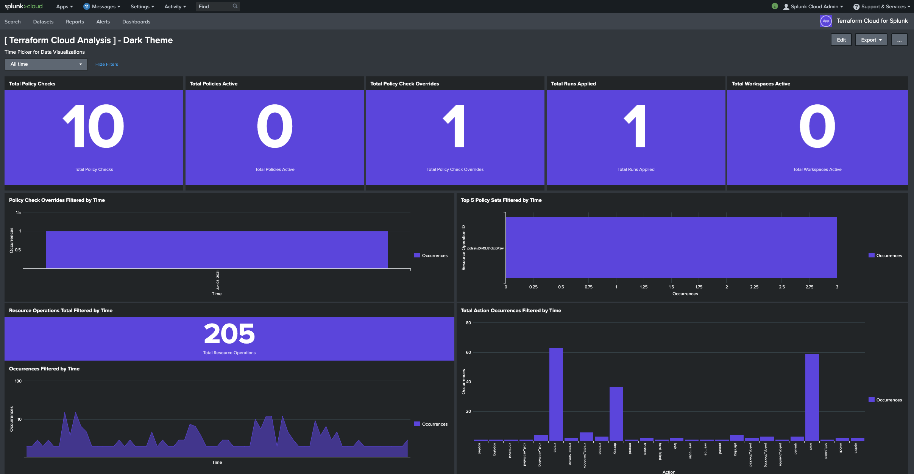

name: AWS-Architecture
# HashiCups Architecture
.center[]
  
---
name: Traditional-App-Deployment
# Current Process
.center[]
  
---
name: Intro-to-PAC
# Introduction to Policy-as-Code (PaC)
.center[]
  
---
name: Business-Outcomes
# Business Outcomes
.center[]
  
---
name: Splunk-Integration
# Splunk Integration
.center[]
  
